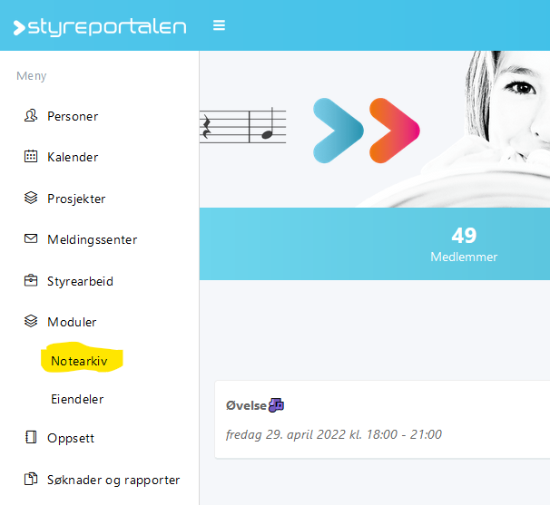
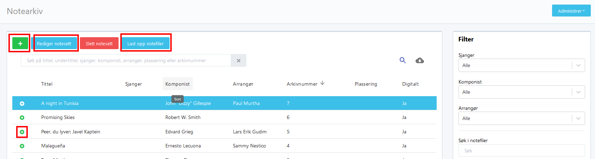
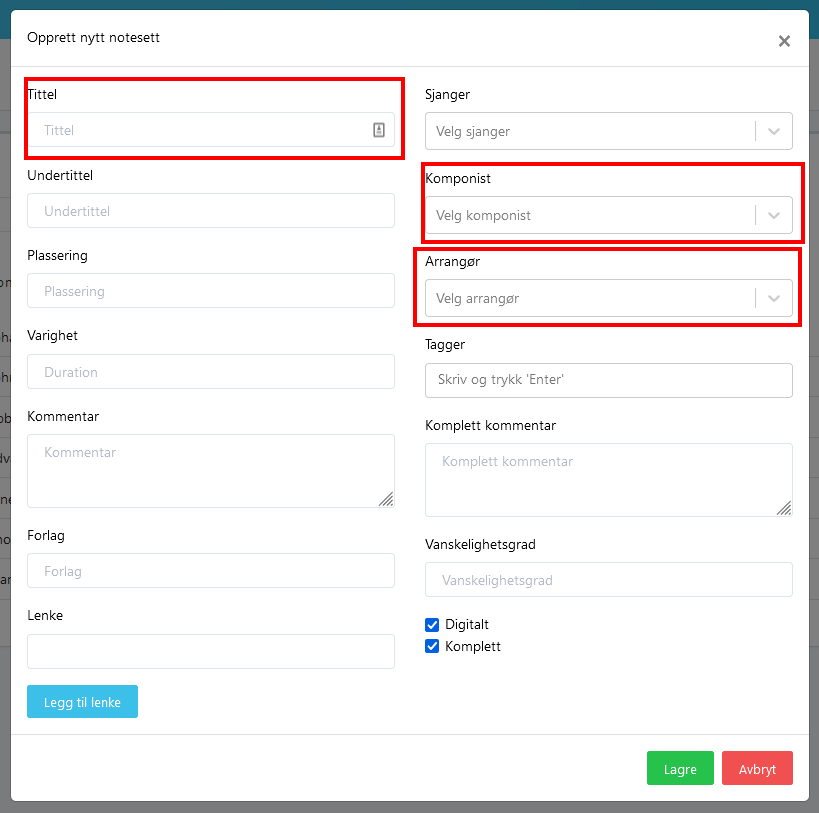
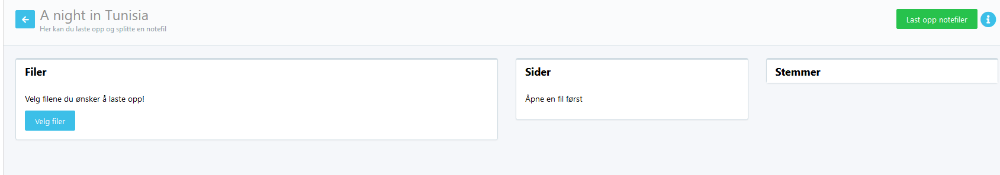
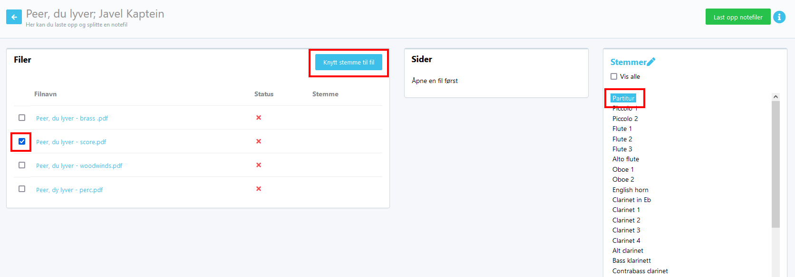
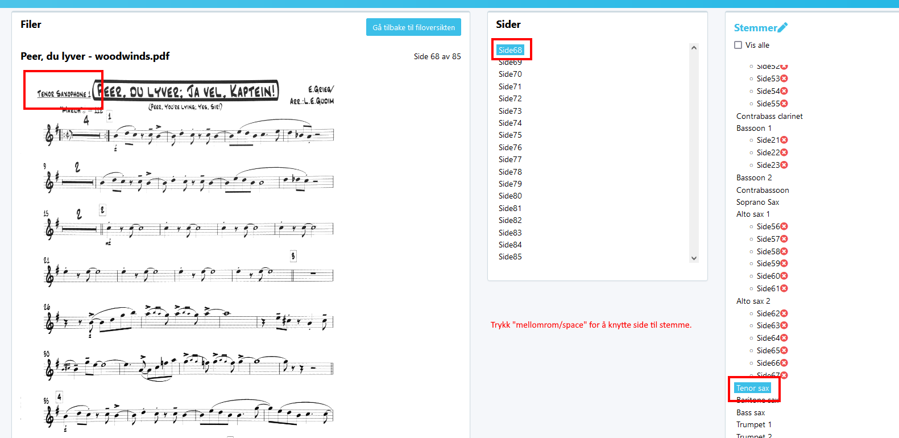
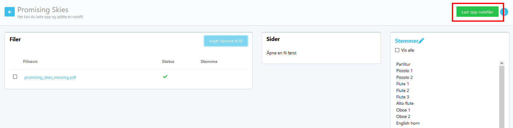

# Bruksanvisning Notearkiv

Notearkiv er et produkt fra Styreportalen rettet mot korps og kor.

## Finne notearkivet

Gå til [Styreportalen --> Moduler --> Notearkiv](https://drift.styreportalen.no/notearchive/notes)

I notearkivet har du nå noen valg:

* **+**: Legge til et nytt notesett
* **Rediger notesett**: Etter først å ha valgt et notesett, slik at det er blått, kan du her redigere informasjon _om_ notesettet, så som komponist, arrangør, sjanger etc.
* **Slett notesett**: Slette det valgte notesettet.
* **Last opp notefiler**: Her kan du legge til flere notefiler/stemmer i det valgte notesettet.'
* Liten + ved notesettet: Her kan du se hvilke notefiler/stemmer som er tilgjengelig på notesettet.

## Legge inn nytt notesett

Først må man legge inn tittel på stykket, komponist og gjerne arrangør om det ikke er originalskrevet musikk. Andre felter kan også fylles inn om man vil det.

Etter disse detaljene er det klart for å laste opp notefiler. Dersom filene er små, så kan man laste opp alle filene, men ved store filer ville jeg tatt en og en fil.

Når filene er lastet opp skal man knytte dette til hver enkelt stemme. Da er det to alternativer:

1. Knytte en hel fil til én stemme. Her må du først velge filen (krysse av i boksen), deretter velge hvilken stemmer den skal knyttes til, og til slutt trykke **Knytt stemme til fil**

2. Knytte en og en side til en stemme. Her må du først velge filen ved å klikke på filnavnet. Du får da se første side i filen. Velg deretter hvilken stemme denne siden skal knyttes til. Nå kan du trykke _mellomrom/space_ for å knytte denne siden til stemmen. Da kommer neste side synlig. Deretter trykke du _mellomrom_ til du kommer til neste stemme. Velg riktig stemme, og fortsett med _mellomrom_. Når filen er ferdig, kan du trykke **Gå tilbake til filoversikten**.

## **VIKTIG**: Lagre

Når du er ferdig med alle filene, så må du trykke på **Last opp notefiler**. Det er dette som lagrer arbeidet du har gjort. Glemmer du dette, så må du gjøre det på nytt.

